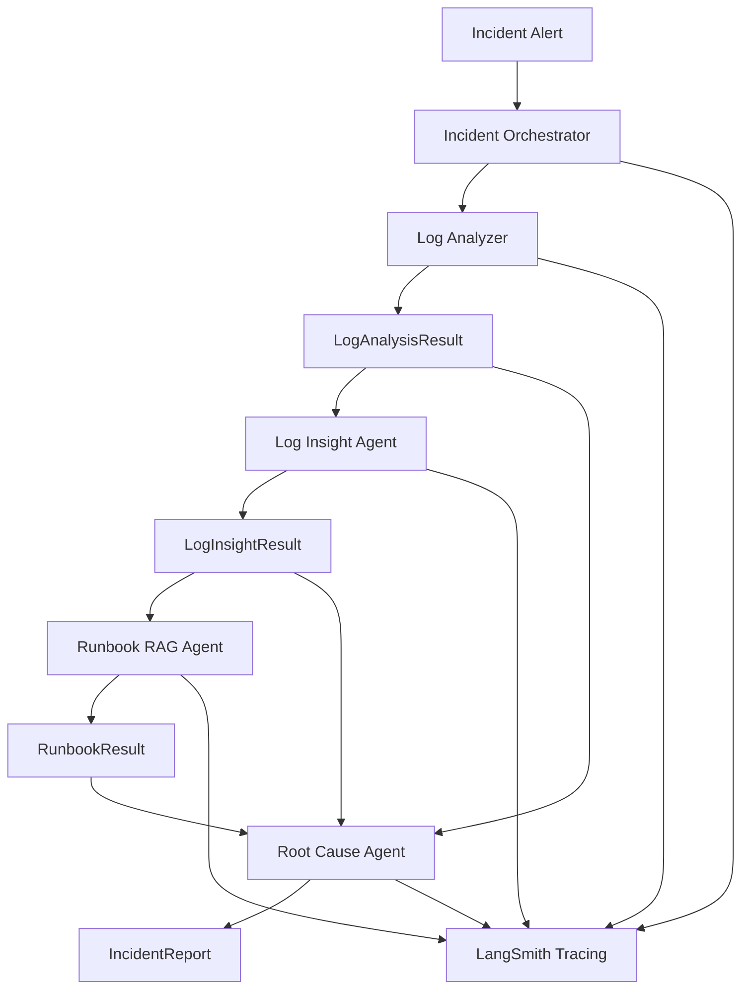
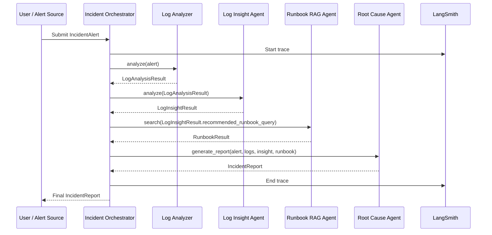
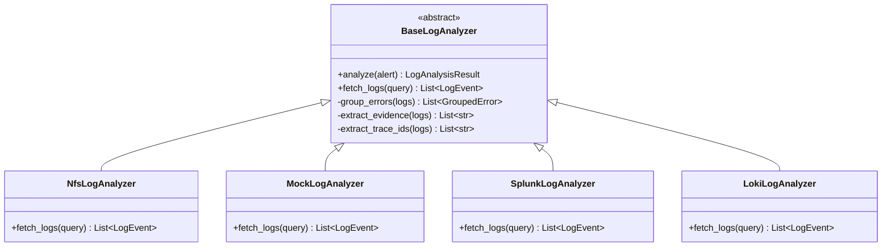
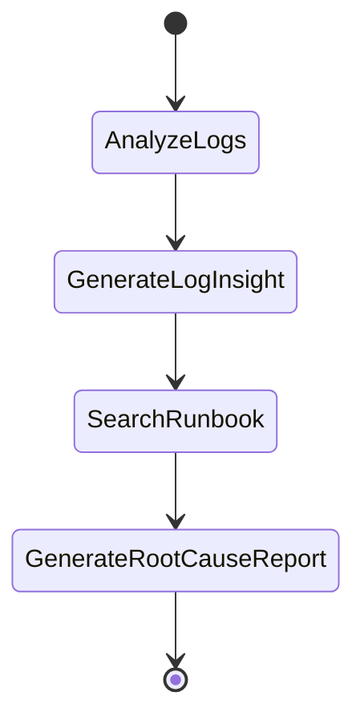
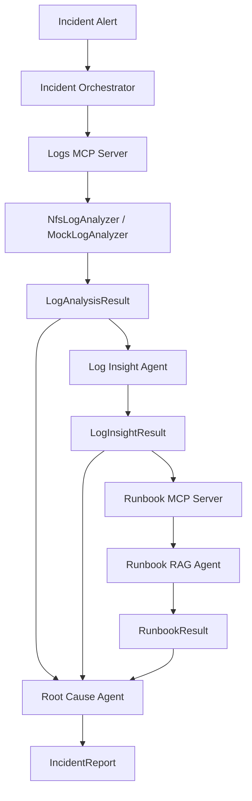

# Incident Resolution Agent — MVP 1 Architecture

## 1. Purpose

The **Incident Resolution Agent MVP 1** is an AI-assisted investigation workflow for production incidents.

The system accepts an incident alert, analyzes application logs, uses AI to interpret log patterns, retrieves relevant runbooks using RAG, and generates an evidence-backed incident report.

MVP 1 is intentionally limited to safe, explainable, read-only investigation.

---

## 2. MVP 1 Scope

### Included

- Incident alert input
- Incident Orchestrator
- Deterministic Log Analyzer
- AI-based Log Insight Agent
- Runbook RAG Agent
- Root Cause Agent
- Structured Incident Report
- LangSmith tracing
- Optional MCP wrapper for logs and runbooks

### Not Included in MVP 1

- Real Splunk/Loki production integration
- Metrics Agent
- Deployment Agent
- Distributed Trace Agent
- Jira/ServiceNow ticket creation
- Slack/Teams notification
- Auto-remediation
- Kubernetes actions

---

## 3. High-Level Architecture



---

## 4. MVP 1 Runtime Flow



---

## 5. Component Responsibilities

## 5.1 Incident Orchestrator

The orchestrator owns the workflow and state.

Responsibilities:

- Validate incident alert
- Create shared incident state
- Call Log Analyzer
- Call Log Insight Agent
- Call Runbook RAG Agent
- Call Root Cause Agent
- Handle failures and fallbacks
- Emit trace metadata to LangSmith

It should not contain deep log parsing, RAG logic, or root-cause rules.

---

## 5.2 Log Analyzer

The Log Analyzer is deterministic and non-AI.

Responsibilities:

- Fetch logs
- Read from mock/NFS log files for MVP 1
- Filter logs by service name
- Filter logs by time window
- Filter ERROR/WARN logs
- Extract trace ID / correlation ID
- Group similar errors
- Count occurrences
- Select representative evidence

Output:

```text
LogAnalysisResult
```

Implementation design:



For MVP 1, implement only:

- `NfsLogAnalyzer`
- `MockLogAnalyzer`

Keep `SplunkLogAnalyzer` and `LokiLogAnalyzer` as future extension points.

---

## 5.3 Log Insight Agent

The Log Insight Agent is the first AI reasoning layer.

It receives `LogAnalysisResult` and returns `LogInsightResult`.

Responsibilities:

- Interpret grouped log errors
- Classify issue category
- Assign confidence
- Explain reasoning
- Suggest next checks
- Generate runbook search query
- Recommend next agent

It should not read raw logs directly.

Input:

```text
LogAnalysisResult
```

Output:

```text
LogInsightResult
```

AI is used here for reasoning over structured findings, not for raw log scanning.

---

## 5.4 Runbook RAG Agent

The Runbook RAG Agent searches operational runbooks and returns relevant troubleshooting steps.

Responsibilities:

- Load local markdown runbooks
- Chunk documents
- Create embeddings
- Store vectors in FAISS/Chroma/pgvector
- Retrieve top matching chunks
- Summarize actionable steps
- Return source documents

Input:

```text
recommended_runbook_query
```

Output:

```text
RunbookResult
```

Example query:

```text
DB connection pool exhaustion Hikari SQLTransientConnectionException
```

---

## 5.5 Root Cause Agent

The Root Cause Agent generates the final report.

Inputs:

- IncidentAlert
- LogAnalysisResult
- LogInsightResult
- RunbookResult

Responsibilities:

- Combine evidence
- Produce probable root cause
- Include confidence
- Include supporting evidence
- Suggest manual actions
- Avoid claiming unsupported causes
- Generate human-readable summary

Output:

```text
IncidentReport
```

---

## 6. Domain Models

## 6.1 IncidentAlert

```python
@dataclass
class IncidentAlert:
    incident_id: str
    service_name: str
    severity: str
    description: str
    start_time: datetime
    end_time: datetime
```

---

## 6.2 LogEvent

```python
@dataclass
class LogEvent:
    timestamp: datetime
    service_name: str
    level: str
    message: str
    source: str
    trace_id: str | None = None
    correlation_id: str | None = None
    metadata: dict | None = None
```

---

## 6.3 GroupedError

```python
@dataclass
class GroupedError:
    message_pattern: str
    count: int
    first_seen: datetime | None
    last_seen: datetime | None
```

---

## 6.4 LogAnalysisResult

```python
@dataclass
class LogAnalysisResult:
    service_name: str
    total_logs: int
    error_count: int
    warning_count: int
    top_errors: list[GroupedError]
    evidence: list[str]
    trace_ids: list[str]
```

---

## 6.5 LogInsightResult

```python
@dataclass
class LogInsightResult:
    suspected_issue: str
    issue_category: str
    confidence: float
    reasoning: str
    next_checks: list[str]
    recommended_runbook_query: str
    recommended_next_agents: list[str]
    fallback_used: bool = False
```

---

## 6.6 RunbookResult

```python
@dataclass
class RunbookResult:
    matched_runbooks: list[str]
    confidence: float
    relevant_steps: list[str]
    source_documents: list[str]
    retrieved_chunks: list[str]
```

---

## 6.7 IncidentReport

```python
@dataclass
class IncidentReport:
    incident_id: str
    service_name: str
    probable_root_cause: str
    confidence: float
    evidence: list[str]
    recommended_actions: list[str]
    human_summary: str
```

---

## 7. LangGraph MVP 1 Flow



Future conditional routing:

```mermaid
flowchart TD
    A[Analyze Logs] --> B{Errors or warnings found?}
    B -->|Yes| C[Generate Log Insight]
    B -->|No| D[Generate No-Signal Report]
    C --> E[Search Runbook]
    E --> F[Generate Root Cause Report]
    D --> F
```



---

## 8. MCP Scope in MVP 1

MVP 1 can work without MCP, but MCP can be added as an integration layer.

Recommended MCP tools for MVP 1:

### Logs MCP Server

Expose business-level tools:

```text
analyze_logs(service_name, start_time, end_time, level, keyword)
```

Internally, for MVP 1:

```text
Logs MCP Server -> NfsLogAnalyzer / MockLogAnalyzer
```

Later:

```text
Logs MCP Server -> Splunk / Loki / CloudWatch
```

---

### Runbook MCP Server

Expose:

```text
search_runbooks(query, top_k)
```

Internally, for MVP 1:

```text
Runbook MCP Server -> local markdown files + vector store
```

Later:

```text
Runbook MCP Server -> Confluence / SharePoint / internal KB
```

---

## 9. Architecture With Optional MCP



---

## 10. Configuration

```yaml
app:
  name: incident-resolution-agent
  environment: local

log_source:
  active: nfs

nfs:
  base_path: ./data/logs
  file_patterns:
    - "*.log"
    - "*.out"

rag:
  vector_store: faiss
  runbook_path: ./data/runbooks
  chunk_size: 800
  chunk_overlap: 100
  top_k: 3

llm:
  provider: openai
  model: gpt-4o-mini
  temperature: 0.1

tracing:
  langsmith_enabled: true
  project_name: incident-resolution-agent-mvp1

mcp:
  enabled: false
  logs_server_enabled: false
  runbook_server_enabled: false
```

---

## 11. Suggested Folder Structure

```text
incident-resolution-agent/
│
├── app/
│   ├── main.py
│   ├── config.yaml
│   │
│   ├── models/
│   │   ├── incident.py
│   │   ├── log.py
│   │   ├── runbook.py
│   │   └── report.py
│   │
│   ├── analyzers/
│   │   ├── base_log_analyzer.py
│   │   ├── nfs_log_analyzer.py
│   │   └── mock_log_analyzer.py
│   │
│   ├── agents/
│   │   ├── incident_orchestrator.py
│   │   ├── log_insight_agent.py
│   │   ├── runbook_rag_agent.py
│   │   └── root_cause_agent.py
│   │
│   ├── rag/
│   │   ├── runbook_loader.py
│   │   ├── vector_store.py
│   │   └── retriever.py
│   │
│   ├── mcp_servers/
│   │   ├── logs_mcp_server.py
│   │   └── runbook_mcp_server.py
│   │
│   ├── data/
│   │   ├── logs/
│   │   │   └── payment-service.log
│   │   └── runbooks/
│   │       ├── db_connection_pool_exhaustion.md
│   │       ├── kafka_consumer_lag.md
│   │       └── external_api_timeout.md
│   │
│   └── utils/
│       ├── config_loader.py
│       └── langsmith_tracing.py
│
├── tests/
│   ├── test_log_analyzer.py
│   ├── test_log_insight_agent.py
│   ├── test_runbook_rag_agent.py
│   └── test_incident_workflow.py
│
├── requirements.txt
└── README.md
```

---

## 12. Demo Scenario

### Input Alert

```json
{
  "incident_id": "INC-1001",
  "service_name": "payment-service",
  "severity": "HIGH",
  "description": "Payment failures increased suddenly",
  "start_time": "2026-06-10T10:15:00",
  "end_time": "2026-06-10T10:45:00"
}
```

### Mock Logs

```text
2026-06-10 10:20:01 ERROR payment-service HikariPool-1 - Connection is not available, request timed out after 30000ms traceId=abc-101
2026-06-10 10:20:05 ERROR payment-service SQLTransientConnectionException: Connection is not available traceId=abc-102
2026-06-10 10:21:01 WARN payment-service DB connection wait time exceeded traceId=abc-103
```

### Expected Final Report

```text
Incident: INC-1001
Service: payment-service
Probable Root Cause: DB connection pool exhaustion
Confidence: 84%

Evidence:
- 342 errors found during incident window
- Most frequent error: Hikari connection timeout
- SQLTransientConnectionException appeared repeatedly
- Matching runbook found: DB Connection Pool Exhaustion

Recommended Actions:
1. Check Hikari active and idle connection metrics
2. Check DB max connection usage
3. Review slow queries
4. Check recent configuration changes
5. Consider rollback only after confirming deployment impact
```

---

## 13. Testing Strategy

### Unit Tests

- Log parser extracts timestamp correctly
- Log parser extracts level correctly
- Trace ID extraction works
- Error grouping works
- NFS analyzer reads multiple files
- Log Insight Agent fallback rules work
- Runbook retriever returns relevant runbook
- Root Cause Agent includes evidence

### Integration Tests

- Incident alert to final report
- No logs found scenario
- Unknown issue scenario
- DB connection pool exhaustion scenario
- External API timeout scenario
- Kafka consumer lag scenario

### Golden Dataset

Create known incident scenarios with expected outputs:

```text
1. DB connection pool exhaustion
2. External API timeout
3. Kafka consumer lag
```

Validate:

- Expected issue category
- Confidence is within expected range
- Evidence count is greater than zero
- Recommended runbook query is not empty
- Final report does not invent unsupported facts

---

## 14. MVP 1 Design Principles

- Keep raw log processing deterministic
- Do not send raw logs directly to LLM
- Use AI only for interpretation and summarization
- Keep orchestrator thin
- Keep components replaceable
- Use structured models between components
- Support fallback logic when LLM fails
- Use LangSmith to trace every major step
- Expose business capabilities through MCP, not internal helper methods

---

## 15. Interview Pitch

I built an AI-powered incident investigation workflow for microservices production support. In MVP 1, the system accepts an incident alert, analyzes service logs, groups errors using deterministic code, uses a Log Insight Agent to interpret the structured findings, searches operational runbooks through RAG, and generates an evidence-backed incident report. I kept the design safe and explainable by avoiding raw-log LLM calls and auto-remediation. The system is also designed to be vendor-neutral, where log and runbook capabilities can be exposed through MCP tools and later backed by Splunk, Loki, CloudWatch, Confluence, or SharePoint.
